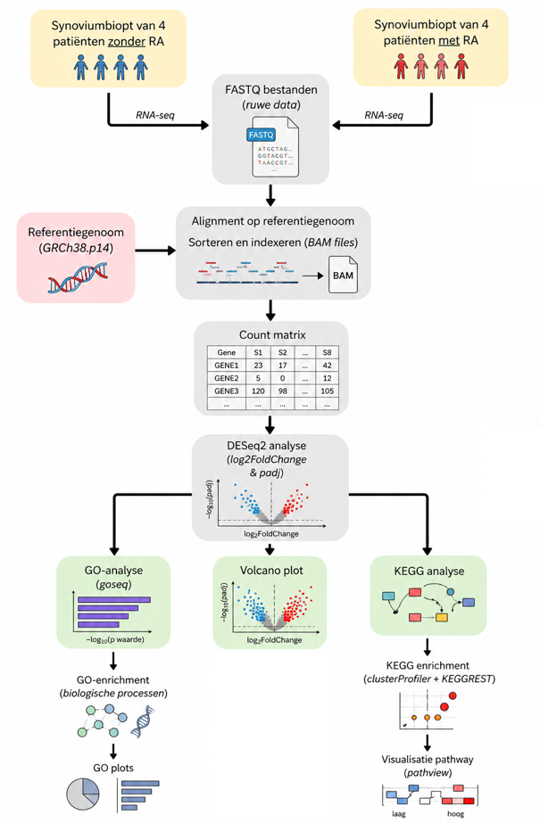
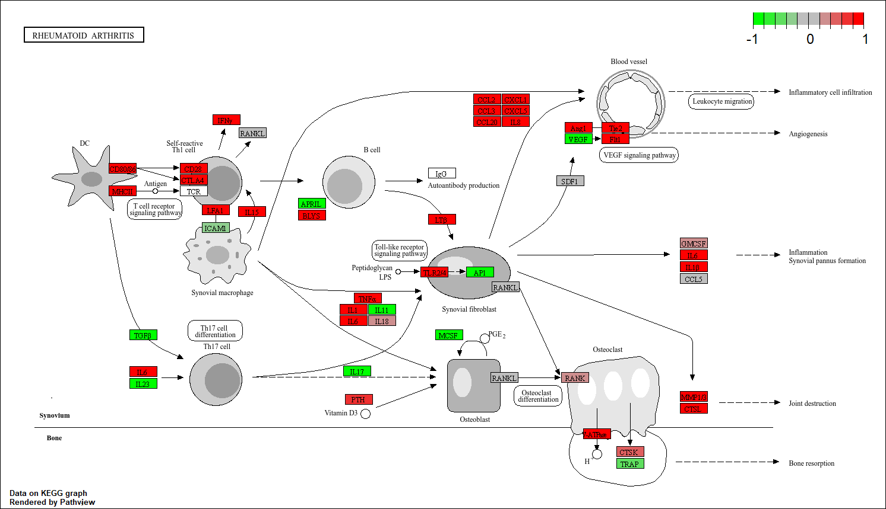
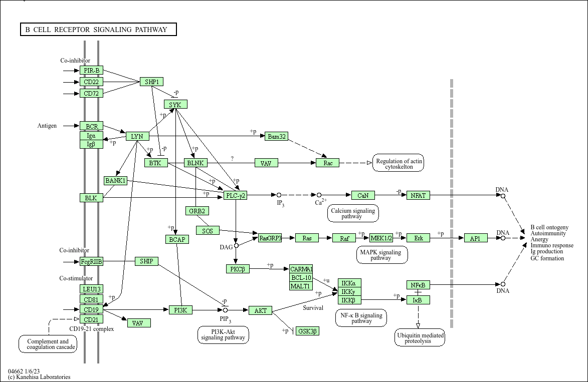

# RNA-seq analyse van Reumatoïde Artritis (RA)

# Inleiding

Reumatoïde artritis (RA) is een chronische auto-immuunziekte waarbij het immuunsysteem lichaamseigen gewrichten aanvalt. Hierdoor ontstaat ontsteking van het synovium (gewrichtsslijmvlies), wat uiteindelijk kan leiden tot gewrichtsschade. Hoewel de exacte oorzaak van RA nog niet volledig bekend is, spelen genetische factoren, omgevingsfactoren en ontregeling van het immuunsysteem een belangrijke rol.

In deze analyse is gebruikgemaakt van RNA-seq data van synoviumbiopten van patiënten met RA en gezonde controles. Het doel was om differentieel tot expressie komende genen en betrokken biologische pathways te identificeren.

Het doel van deze casus is om met behulp van RNA-seq analyse verschillen in genexpressie tussen synoviumweefsel van patiënten met reumatoïde artritis (RA) en gezonde controles te identificeren. Daarnaast wordt onderzocht welke biologische processen en pathways betrokken zijn bij de ziekte door middel van GO enrichment analyse en KEGG pathway analyse.

Voor deze casus zijn de volgende deelvragen opgezet
- 1.	Welke genen komen differentieel tot expressie in synoviumweefsel van RA-patiënten vergeleken met gezonde controles?
- 2.	Welke biologische processen zijn oververtegenwoordigd in de differentieel tot expressie komende genen?
- 3.	Welke immuun-gerelateerde pathways spelen mogelijk een rol bij reumatoïde artritis?

---

## Methoden
Voor deze analyse zijn 4 RNA-seq samples van RA-patiënten en 4 controle samples gebruikt.

De analyse werd uitgevoerd in R met de volgende stappen:

  

De analyse werd uitgevoerd in R met de volgende stappen:

- Aligneren van FASTQ-bestanden tegen het [humane referentiegenoom](https://www.ncbi.nlm.nih.gov/datasets/genome/GCF_000001405.26/) met Rsubread(version 2.24.0)
- Tellen van reads per gen met featureCounts
- Differential expression analyse met DESeq2(version 1.50.2)
- Visualisatie met een volcano plot door EnhancedVolcano(version 1.28.2)
- Gene Ontology (GO) enrichment analyse met goseq(version 1.62.0)
- KEGG pathway analyse met pathview(version 1.70.0)

Genen worden als significant beschouwd bij een adjusted p-value (padj) van < 0.05 en een |log2FoldChange| > 1

---

## Resultaten

De differential expression analyse liet duidelijke verschillen zien tussen RA-samples en controles. Zowel opgereguleerde als neergereguleerde genen werden geïdentificeerd.

Een volcano plot werd gebruikt om de significant differentieel tot expressie komende genen te visualiseren.

  

Met behulp van goseq werd onderzocht welke biologische processen oververtegenwoordigd waren in de differentieel tot expressie komende genen.

De sterkst verrijkte GO-term was het Immunoglobulin mediated immune response

Dit betekend dat er verhoogde activiteit van B-cellen en antistofproductie in het synovium van RA-patiënten is. Dit sluit aan bij de bekende rol van auto-antistoffen, zoals ACPA, bij reumatoïde artritis[insert bron].

  

Met de pathview functie [version number] werden pathways gevisualiseerd die betrokken zijn bij RA. Hierbij werden humane KEGG pathways gebruikt, waaronder:

Rheumatoid arthritis (hsa05323)
B cell receptor signaling pathway (hsa04662)

De pathway analyse liet verhoogde expressie zien van meerdere immuungerelateerde genen, wat de resultaten van de GO-analyse ondersteunt.

  
  

---

## Conclusie

De RNA-seq analyse toont aan dat immuun-gerelateerde processen sterk geactiveerd zijn in synoviumweefsel van RA-patiënten. Zowel de GO enrichment analyse als de KEGG pathway analyse wijzen op verhoogde activiteit van B-cellen en antistof-gemedieerde immuunresponsen. Deze resultaten passen goed binnen het bekende ziektebeeld van reumatoïde artritis.
Voor vervolgonderzoek wordt aanbevolen om gebruik te maken van een grotere samplegrootte om de statistische betrouwbaarheid van de resultaten te verhogen. Daarnaast kan aanvullend onderzoek naar specifieke immuun-gerelateerde pathways, zoals B-cell receptor signaling en cytokine signaling, meer inzicht geven in de rol van het immuunsysteem bij reumatoïde artritis.
## Databeheer

