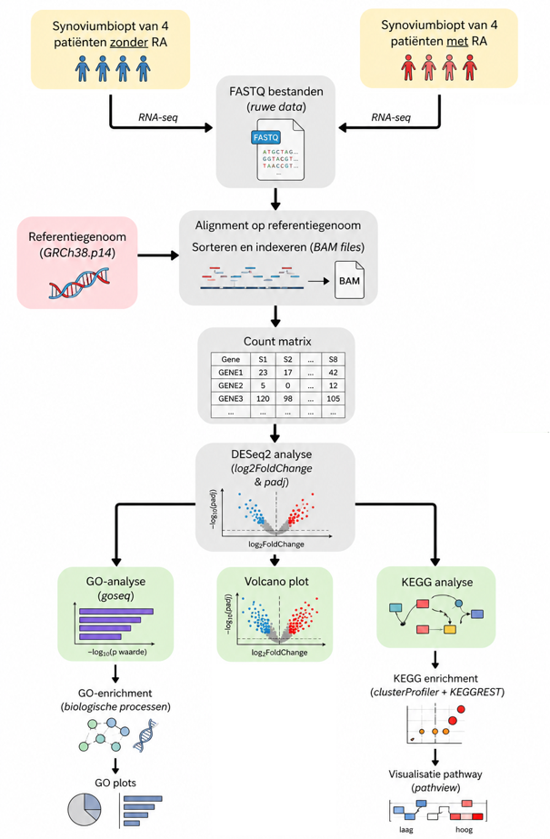
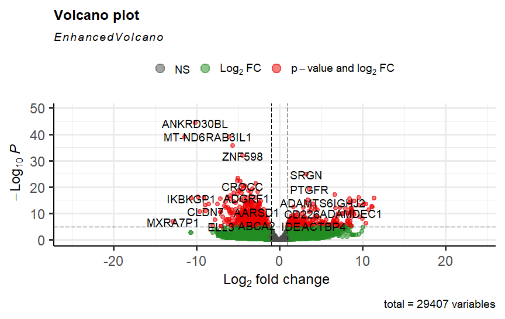
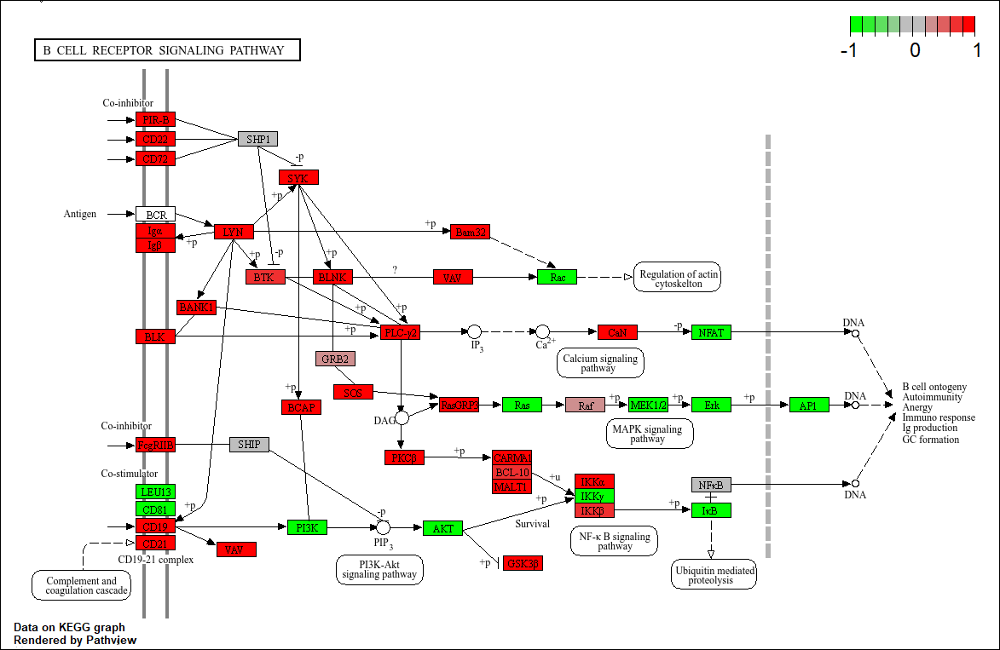

# RNA-seq analyse van synoviumweefsel bij reumatoïde artritis

# Inleiding

Reumatoïde artritis (RA) is een chronische auto-immuunziekte waarbij het immuunsysteem lichaamseigen gewrichten aanvalt. Hierdoor ontstaat ontsteking van het synovium (gewrichtsslijmvlies), wat uiteindelijk kan leiden tot gewrichtsschade. Hoewel de exacte oorzaak van RA nog niet volledig bekend is, spelen genetische factoren, omgevingsfactoren en ontregeling van het immuunsysteem een belangrijke rol[(Gabriel, 2001; ](https://doi.org/10.1016/S0889-857X(05)70201-5)[Platzer et al., 2019)](https://doi.org/10.1371/journal.pone.0219709).

RA is bekend door complexe veranderingen in genexpressie in het synoviale weefsel, waarbij vooral immuun-gerelateerde pathways sterk geactiveerd zijn. RNA-seq studies hebben aangetoond dat deze veranderingen op transcriptieniveau inzichten kunnen geven in ziekteactiviteit en onderliggende biologische mechanismen[(Platzer et al., 2019)](https://doi.org/10.1371/journal.pone.0219709).

In deze analyse is gebruikgemaakt van RNA-seq data van synoviumbiopten van patiënten met RA en gezonde controles. Het doel was om differentieel tot expressie komende genen en betrokken biologische pathways te identificeren.

Het doel van deze casus is om met behulp van RNA-seq analyse verschillen in genexpressie tussen synoviumweefsel van patiënten met reumatoïde artritis (RA) en gezonde controles te identificeren. Daarnaast wordt onderzocht welke biologische processen en pathways betrokken zijn bij de ziekte door middel van GO enrichment analyse en KEGG pathway analyse.

Voor deze casus zijn de volgende deelvragen opgezet
- 	Welke genen komen differentieel tot expressie in synoviumweefsel van RA-patiënten vergeleken met gezonde controles?
- 	Welke biologische processen zijn oververtegenwoordigd in de differentieel tot expressie komende genen?
- 	Welke immuun-gerelateerde pathways spelen mogelijk een rol bij reumatoïde artritis?

---

## Methoden
De volledige analyse is uitgevoerd met het script [Main_R_File_transcriptomics.R](R%20files/Main_R_File_transcriptomics.R). Dit script voert de RNA-seq analyse uit vanaf de alignering van de ruwe FASTQ-bestanden tot en met de differentiële genexpressieanalyse, Gene Ontology (GO) enrichment analyse en KEGG pathway analyse.
De stappen van deze casus bestaan uit de volgende onderdelen(zie ook Figuur 1):
1.	Installeren en laden van de benodigde R-packages.
2.	Opbouwen van een index van het humane referentiegenoom (GRCh38.p14).
3.	Aligneren van paired-end FASTQ-bestanden tegen het referentiegenoom.
4.	Kwantificeren van reads per gen met featureCounts.
5.	Aanmaken van een count matrix.
6.	Uitvoeren van de differentiële genexpressieanalyse met DESeq2.
7.	Visualiseren van de resultaten met een volcano plot.
8.	Uitvoeren van een Gene Ontology enrichment analyse.
9.	Visualiseren van relevante KEGG pathways met pathview.

  
  
  <em>Figuur 1: Flowchart van uitgevoerde stappen binnen deze casus</em>

________________________________________

#Software

Alle analyses zijn uitgevoerd in R versie 4.6.0 binnen [RStudio](https://docs.posit.co/ide/user/#rstudio-ide-oss-downloads).
De volgende packages zijn gebruikt tijdens de analyse:

| Package |	Versie | Doel |
| :------- | :-----: | :----: |
| [Rsubread](https://www.bioconductor.org/packages//release/bioc/html/Rsubread.html) |2.24.0 | Alignering en featureCounts |
| [Rsamtools](https://bioconductor.org/packages/release/bioc/html/Rsamtools.html) | 2.28.0	| Verwerken van BAM-bestanden |
| [DESeq2](https://bioconductor.org/packages/release/bioc/html/DESeq2.html) | 1.50.2	|Differential expression analyse|
| [EnhancedVolcano](https://bioconductor.org/packages/release/bioc/html/EnhancedVolcano.html) | 1.28.2	| Volcano plot |
| [goseq](https://bioconductor.org/packages/release/bioc/html/goseq.html) | 1.62.0	|   GO enrichment analyse |
| [pathview](https://bioconductor.org/packages/release/bioc/html/pathview.html) | 1.70.0	| KEGG pathway visualisatie |
| [KEGGREST](https://bioconductor.org/packages//release/bioc/html/KEGGREST.html) | 1.52.2	| Ophalen KEGG informatie |
| [biomaRt](https://bioconductor.org/packages/release/bioc/html/biomaRt.html) | 2.68.0	| Genannotaties |
| [org.Hs.eg.db](https://bioconductor.org/packages/release/data/annotation/html/org.Hs.eg.db.html) | 3.23.1	| Entrez-ID annotaties |
| [GO.db](https://bioconductor.org/packages/release/data/annotation/html/GO.db.html) | 3.23.1	| Gene Ontology database |
| [tidyverse](https://cran.r-project.org/web/packages/tidyverse/index.html) | 2.0.0 | Dataverwerking en visualisatie |
| [dplyr](https://cran.r-project.org/web/packages/dplyr/index.html) | 1.2.1 | Dataverwerking en visualisatie |
| [ggplot2](https://cran.r-project.org/web/packages/ggplot2/ggplot2.pdf) | 4.0.3 | Dataverwerking en visualisatie |

________________________________________
#Referentiegenoom

Voor de alignering is gebruikgemaakt van het humane referentiegenoom:
GCF_000001405.40_GRCh38.p14.
Dit referentiegenoom is gedownload via de [NCBI Genoma Database](https://www.ncbi.nlm.nih.gov/datasets/genome/GCF_000001405.40/).
Voordat de reads konden worden uitgelijnd, is met behulp van de functie buildindex() uit het package Rsubread een indexbestand opgebouwd. Deze index wordt vervolgens gebruikt om alle RNA-seq reads efficiënt tegen het referentiegenoom uit te lijnen.
________________________________________
#Alignering

De acht paired-end FASTQ-bestanden zijn afzonderlijk uitgelijnd tegen het humane referentiegenoom met de functie align() uit het package Rsubread.
Voor ieder sample wordt een afzonderlijk BAM-bestand aangemaakt.
De analyse bestaat uit vier controlesamples en vier samples afkomstig van patiënten met reumatoïde artritis.
De gegenereerde BAM-bestanden worden opgeslagen in de map Processed Data, zodat deze later opnieuw gebruikt kunnen worden zonder de alignering opnieuw uit te voeren.
________________________________________
#Read quantificatie

Na de alignering wordt voor ieder gen het aantal gemapte reads bepaald met behulp van featureCounts.
Hierbij wordt gebruikgemaakt van een GTF-annotatiebestand (genomic.gtf), waarbij reads worden samengevoegd tot gen-niveau (useMetaFeatures = TRUE).
De resulterende count matrix wordt opgeslagen als:
Ref_Human_genome.csv
Deze matrix bevat voor ieder gen het aantal reads per sample.
________________________________________
#Count matrix

Hoewel het script eerst zelfstandig een count matrix genereert uit de FASTQ-bestanden, wordt vanaf de differentiële genexpressieanalyse gebruikgemaakt van een door de docent aangeleverde count matrix (count_matrix_RA.txt).
Deze dataset bevat dezelfde acht biologische samples, maar een verbeterde genkwantificatie. Hierdoor konden de downstream analyses consistenter worden uitgevoerd.
In het script is duidelijk aangegeven waar wordt overgeschakeld van de zelf gegenereerde count matrix naar de aangeleverde matrix.
________________________________________
#Differential expression analyse

Differentiële genexpressie werd bepaald met behulp van het package DESeq2. Na het aanmaken van het DESeqDataSet object werd de analyse uitgevoerd met de functie DESeq().
Voor ieder gen werden vervolgens de fold change, standaardfout, wald-statistiek, p-waarde en adjusted p-value berekend.
Genen werden als significant beschouwd wanneer de adjusted p-value < 0,05 en |log2FoldChange| > 1
De volledige resultaten worden opgeslagen als .csv bestand.
________________________________________
#Volcano plot

Om de differentiële genexpressie te visualiseren is gebruikgemaakt van het package EnhancedVolcano.
De volcano plot toont voor ieder gen de log2FoldChange en de adjusted p-value.
Hiermee worden zowel sterk opgereguleerde als sterk neerwaarts gereguleerde genen zichtbaar.
Het figuur wordt automatisch opgeslagen als het R script wordt gerund.
________________________________________
#Gene Ontology enrichment analyse

Om te bepalen welke biologische processen oververtegenwoordigd zijn binnen de significant differentieel tot expressie komende genen, is een GO enrichment analyse uitgevoerd met goseq.
Omdat RNA-seq analyses gevoelig zijn voor bias door verschillen in genlengte [(Young et al., 2010)](https://doi.org/10.1186/gb-2010-11-2-r14), zijn eerst de genlengtes opgehaald via biomaRt.
Met behulp van nullp() wordt vervolgens gecorrigeerd voor deze lengtebias.
Daarna wordt met goseq() onderzocht welke GO Biological Process-termen significant verrijkt zijn.
De tien meest significante GO-termen worden vervolgens weergegeven in een scatterplot waarin zowel de oververtegenwoordigings-p-waarde als het percentage veranderde genen per GO-term wordt weergegeven.
Het figuur wordt automatisch opgeslagen als het R script wordt gerund.
________________________________________
#KEGG pathway analyse

Om de differentieel tot expressie komende genen biologisch te interpreteren is een KEGG pathway analyse uitgevoerd met pathview.
Eerst worden de gen-symbolen automatisch omgezet naar Entrez Gene IDs met behulp van het package org.Hs.eg.db.
Vervolgens worden de log2FoldChanges geprojecteerd op geselecteerde humane KEGG pathways.
De pathwayfiguren worden automatisch opgeslagen in de map Figuren.

---

## Resultaten

De RNA-seq analyse werd uitgevoerd om verschillen in genexpressie tussen synoviumweefsel van patiënten met reumatoïde artritis (RA) en gezonde controles te identificeren. De analyse bestond uit drie opeenvolgende onderdelen: een differentiële genexpressieanalyse, een Gene Ontology (GO) enrichment analyse en een KEGG pathway analyse.
________________________________________
#Differential expression analyse

Het doel van de differentiële genexpressieanalyse was het identificeren van genen waarvan de expressie significant verschilde tussen RA-patiënten en gezonde controles.
De analyse liet duidelijke verschillen in genexpressie zien tussen beide groepen. Er waren 2085 opgereguleerde genen en 2487 neerwaarts gereguleerde genen geïdentificeerd, wat aangeeft dat meerdere biologische processen verschillen tussen gezond weefsel en weefsel afkomstig van patiënten met reumatoïde artritis.
De resultaten zijn weergegeven in een volcano plot (Figuur 2). Hierin wordt voor ieder gen de log2FoldChange uitgezet tegen de negatieve log10 van de adjusted p-value. Hierdoor zijn zowel de mate van expressieverandering als de statistische significantie in één figuur zichtbaar.

  
  
  <em>Figuur 2: Volcano plot van de differentiële genexpressie tussen synoviumweefsel van vier patiënten met reumatoïde artritis en vier gezonde controles. Op de x-as staat de log2FoldChange weergegeven en op de y-as de negatieve log10 van de adjusted p-value. Genen werden als significant beschouwd bij een adjusted p-value kleiner dan 0,05 en een absolute log2FoldChange groter dan 1.(padj)</em>

________________________________________
#Gene Ontology enrichment analyse

Na het identificeren van de differentieel tot expressie komende genen werd onderzocht welke biologische processen significant oververtegenwoordigd waren. Hiervoor werd een Gene Ontology (GO) enrichment analyse uitgevoerd.
De sterkst verrijkte GO-term was het Immunoglobulin mediated immune response.
Deze verrijking wijst op een verhoogde activiteit van genen die betrokken zijn bij immunoglobuline-gemedieerde immuunresponsen. Dit ondersteunt het bekende ziektebeeld van reumatoïde artritis, waarbij B-cellen en auto-antistoffen een belangrijke rol spelen in de pathogenese van de ziekte.
De GO-analyse liet daarnaast zien dat meerdere immuungerelateerde processen oververtegenwoordigd waren binnen de differentieel tot expressie komende genen.
De resultaten van de GO enrichment analyse zijn weergegeven in Figuur 3.

  
  
  <em>Figuur 3: Overzicht van de tien meest significant verrijkte GO Biological Process-termen. Op de x-as is het percentage differentieel tot expressie komende genen binnen iedere GO-term weergegeven. De grootte van de punten geeft het aantal significant veranderde genen binnen iedere categorie weer, terwijl de kleur overeenkomt met de oververtegenwoordigings-p-waarde berekend met goseq.</em>

________________________________________
#KEGG pathway analyse

Om de biologische betekenis van de differentieel tot expressie komende genen verder te interpreteren, werd een KEGG pathway analyse uitgevoerd.
De pathway analyse liet verhoogde expressie zien van meerdere genen die betrokken zijn bij ontstekingsreacties en adaptieve immuunresponsen. Zowel de pathway Rheumatoid arthritis als de B cell receptor signaling pathway bevatten meerdere genen met verhoogde expressie in de RA-groep ten opzichte van de controles.
Deze resultaten sluiten aan bij de bevindingen uit de GO enrichment analyse en ondersteunen het beeld dat B-cellen en immunoglobuline-gemedieerde immuunprocessen een belangrijke rol spelen bij reumatoïde artritis.

  
  
  <em>Figuur 4: Visualisatie van de KEGG pathway Rheumatoid arthritis (hsa05323), gegenereerd met pathview. De kleuren geven de richting en grootte van de log2FoldChange weer voor de genen die onderdeel uitmaken van deze pathway.</em>

 

  
  
  <em>Figuur 5: Visualisatie van de KEGG pathway B cell receptor signaling pathway (hsa04662). De figuur laat zien welke genen binnen deze signaalroute differentieel tot expressie komen tussen RA-patiënten en gezonde controles.</em>

---

## Conclusie

Het doel van deze studie was het identificeren van verschillen in genexpressie tussen synoviumweefsel van patiënten met reumatoïde artritis (RA) en gezonde controles met behulp van een RNA-seq analyse. De differentiële genexpressieanalyse liet zien dat meerdere genen significant verschillend tot expressie kwamen tussen beide groepen.
De Gene Ontology (GO) enrichment analyse toonde aan dat voornamelijk immuun-gerelateerde biologische processen anders waren tussen de twee groepen. De meest significante GO-term was Immunoglobulin mediated immune response, wat een verhoogde activiteit van B-cellen en antistofgemedieerde afweermechanismen. Verder liet de KEGG pathway analyse verhoogde activiteit zien binnen de pathways Rheumatoid arthritis (hsa05323) en B cell receptor signaling pathway (hsa04662). Deze bevindingen beantwoorden de onderzoeksvragen en laten zien dat zowel specifieke genen als immuun-gerelateerde biologische processen en signaalroutes verschillen tussen RA-patiënten en gezonde controles.
De resultaten sluiten goed aan bij de huidige kennis over de pathogenese van reumatoïde artritis. Het is bekend dat B-cellen, auto-antistoffen en chronische ontstekingsprocessen een centrale rol spelen bij het ontstaan en onderhouden van de ziekte (Smolen et al., 2016). Ook eerdere transcriptomicsstudies hebben laten zien dat genexpressie in synoviumweefsel van RA-patiënten wordt gekenmerkt door een verhoogde activiteit van immuun-gerelateerde genen en pathways, waaronder B-celactivatie en antistofgemedieerde immuunresponsen (Platzer et al., 2019). De verrijking van de GO-term Immunoglobulin mediated immune response en de gevonden KEGG pathways zijn daarom in overeenstemming met eerder gepubliceerde resultaten. Daarnaast onderstrepen deze bevindingen het belang van B-cellen als potentiële biomarkers en therapeutische aangrijpingspunten bij RA (Bugatti et al., 2014).
Een beperking van deze studie is het relatief kleine aantal geanalyseerde samples, waardoor de statistische kracht beperkt is en minder subtiele verschillen mogelijk niet zijn gedetecteerd. Daarnaast is voor de differentiële genexpressieanalyse gebruikgemaakt van een door de docent aangeleverde count matrix, terwijl de eerdere stappen van de workflow zijn uitgevoerd op de oorspronkelijke RNA-seq data. Hoewel deze werkwijze binnen de casus is verantwoord en duidelijk is gedocumenteerd, kan het gebruik van één consistente dataset de reproduceerbaarheid verder verbeteren.
________________________________________
##Databeheer
Databeheer
Goed databeheer is belangrijk om onderzoek overzichtelijk, reproduceerbaar en betrouwbaar te maken. Tijdens een RNA-seq analyse worden veel verschillende bestanden aangemaakt, zoals FASTQ-bestanden, BAM-bestanden, count matrices, scripts en figuren. Door deze bestanden gestructureerd op te slaan blijven analyses eenvoudig terug te vinden en opnieuw uit te voeren.
Mappenstructuur
De repository is verdeeld in vier hoofdmappen:
RNA-seq_analyse/

├── README.md
├── Figuren/
├── R File/
├── Raw Data/
└── Processed Data/
De map Raw Data bevat de originele FASTQ-bestanden. Alle bestanden die tijdens de analyse worden gegenereerd, zoals BAM-bestanden, de count matrix en DESeq2-resultaten, worden opgeslagen in Processed Data. De map Figuren bevat alle automatisch gegenereerde figuren en in R File staan het script Main_R_File_transcriptomics.R en het bijbehorende RData-bestand.
Naamgeving en versiebeheer
Bestanden hebben een duidelijke en consistente naamgeving, bijvoorbeeld Main_R_File_transcriptomics.R en Resultaten.csv. Hierdoor zijn bestanden eenvoudig terug te vinden.
Voor versiebeheer is gebruikgemaakt van Git en GitHub. Door regelmatig wijzigingen op te slaan met commits blijft de ontwikkelgeschiedenis van het project behouden en kunnen eerdere versies indien nodig worden teruggezet.
Documentatie en reproduceerbaarheid
Het script Main_R_File_transcriptomics.R bevat commentaarregels waarin iedere stap van de analyse wordt toegelicht. De README beschrijft de gebruikte dataset, software, workflow en repositorystructuur, zodat andere onderzoekers de analyse eenvoudig kunnen volgen en gebruiken voor eigen onderzoek. 
Veilig omgaan met data
De gebruikte RNA-seq data zijn afkomstig uit een eerder gepubliceerd onderzoek en bevatten geen herleidbare persoonsgegevens. De ruwe data blijven ongewijzigd opgeslagen, terwijl GitHub fungeert als centrale locatie voor scripts, documentatie en versiebeheer.
GitHub en reproduceerbaarheid
GitHub is gebruikt als centrale omgeving voor het beheren van scripts, documentatie en resultaten. Dankzij de overzichtelijke mappenstructuur, duidelijke bestandsnamen en het centrale script Main_R_File_transcriptomics.R zijn alle onderdelen van de analyse eenvoudig terug te vinden. De README beschrijft stap voor stap hoe de workflow is uitgevoerd, welke software is gebruikt en welke bestanden nodig zijn.
Door gebruik te maken van Git voor versiebeheer blijven alle wijzigingen inzichtelijk en kunnen eerdere versies van bestanden eenvoudig worden hersteld. Samen met de uitgebreide documentatie en de gestructureerde repository draagt dit bij aan een reproduceerbare en transparante RNA-seq analyse.

---

## Bronnen

Bugatti, S., Vitolo, B., Caporali, R., Montecucco, C., & Manzo, A. (2014). *B cells in rheumatoid arthritis: from pathogenic players to disease biomarkers*. BioMed Research International, 2014, 681678. https://doi.org/10.1155/2014/681678

Gabriel, S. E. (2001). *The epidemiology of rheumatoid arthritis*. Rheumatic Disease Clinics of North America, 27(2), 269–281. https://doi.org/10.1016/S0889-857X(05)70201-5

Majithia, V., & Geraci, S. A. (2007). *Rheumatoid Arthritis: Diagnosis and Management*. The American Journal of Medicine, 120(11), 936–939. https://doi.org/10.1016/j.amjmed.2007.04.005

Platzer, A., Nussbaumer, T., Karonitsch, T., Smolen, J. S., & Aletaha, D. (2019). *Analysis of gene expression in rheumatoid arthritis and related conditions offers insights into sex-bias, gene biotypes and co-expression patterns*. PLOS ONE, 14(7). https://doi.org/10.1371/journal.pone.0219709

Smolen, J. S., Aletaha, D., McInnes, I. B. (2016). *Rheumatoid arthritis*. New England Journal of Medicine, 374(21), 2023–2038. https://doi.org/10.1056/NEJMra1507093

Young, M. D., Wakefield, M. J., Smyth, G. K., & Oshlack, A. (2010). *Gene ontology analysis for RNA-seq: accounting for selection bias*. Genome Biology, 11, R14. https://doi.org/10.1186/gb-2010-11-2-r14

